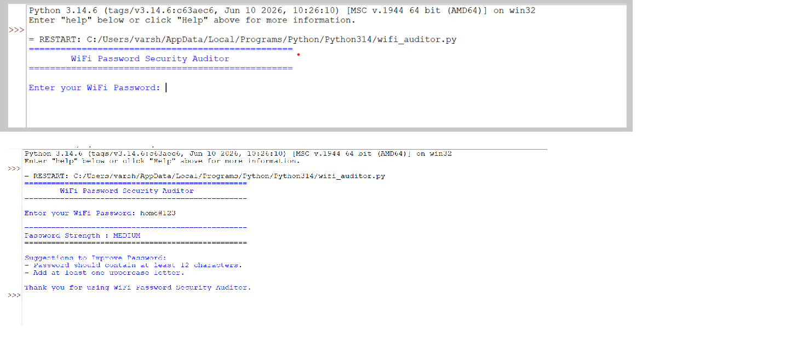
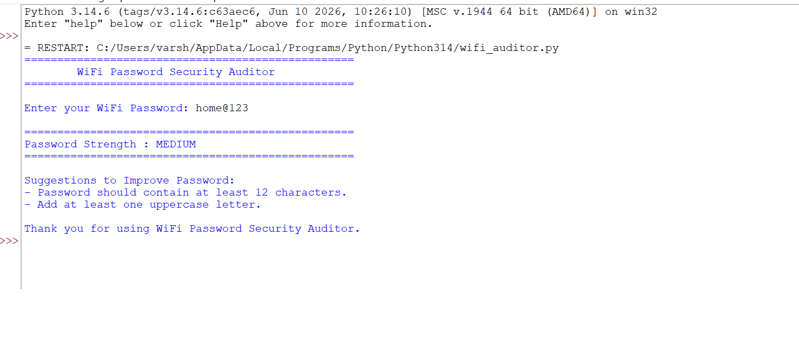

# WiFi Password Security Auditor

## Project Overview

The WiFi Password Security Auditor is a Python-based application that evaluates the strength of a WiFi password. It checks whether the password meets common security requirements such as minimum length, uppercase letters, lowercase letters, numbers, and special characters. The program then classifies the password as Weak, Medium, or Strong and provides suggestions to improve its security.

---

## Features

- Checks password length (minimum 12 characters)
- Detects uppercase letters
- Detects lowercase letters
- Detects numeric digits
- Detects special characters
- Displays password strength
- Provides suggestions to create a stronger password
- Beginner-friendly Python project

---

## Technologies Used

- Python 3
- Regular Expressions (re module)

---

## Project Structure

wifi-password-security-auditor/
│
├── wifi_auditor.py
├── README.md
├── requirements.txt
└── screenshots/
    ├── input.png
    └── output.png

---

## Installation

1. Install Python 3.
2. Download or clone this repository.
3. Open the project folder in Visual Studio Code or any Python IDE.
4. Open the terminal.
5. Run the following command:

bash
python wifi_auditor.py

---

## How It Works

1. The user enters a WiFi password.
2. The program checks:
   - Password length
   - Uppercase letters
   - Lowercase letters
   - Numbers
   - Special characters
3. A score is calculated.
4. The password is classified as:
   - Weak
   - Medium
   - Strong
5. Suggestions are displayed if the password needs improvement.

---

## Example

### Input

Enter your WiFi Password:

Home123

### Output

Password Strength : MEDIUM

Suggestions to Improve Password:

- Password should contain at least 12 characters.
- Add at least one special character.

---

## Future Enhancements

- Random secure password generator
- Password entropy calculation
- GUI using Tkinter
- Password history checker
- Save password audit reports

---

## Screenshots

### Input

Save the terminal screenshot as:

screenshots/input.png

### Output

Save the result screenshot as:

screenshots/output.png

---

## Requirements

No external libraries are required.

Python Version: *3.x*

---

## License

This project is created for educational and internship purposes.

---

## Author
varsha kn

*Varsha KN*
## Screenshots

### Input

### Output

